# JZSBOT (Desktop Pet Robot)
A custom desktop robot with the personality of my fav streamer. Built entirely from scratch I designed both the custom electronics (PCB) and the physical 3D body (CAD).

## 🛠️ Hardware & PCB Design
The schematic was designed in Altium, split into 3 sheets for better readability.

### Schematics
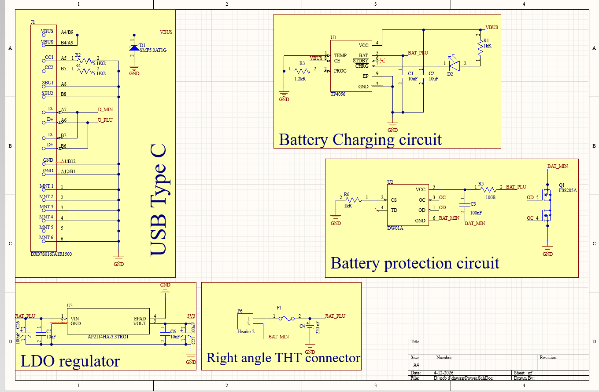
*Sheet 1: Power Section*

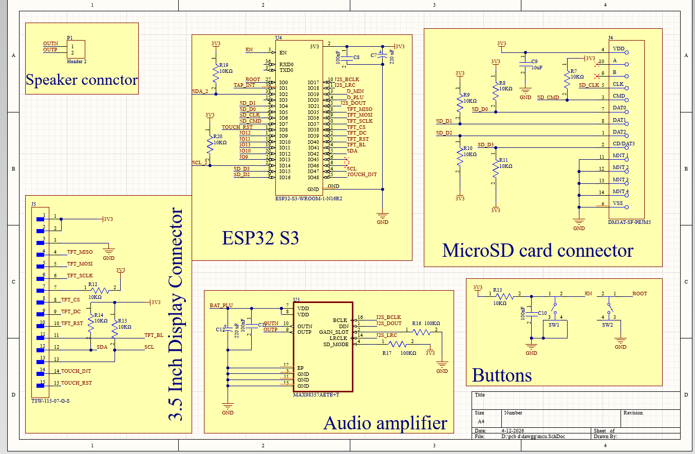
*Sheet 2: MCU Section*

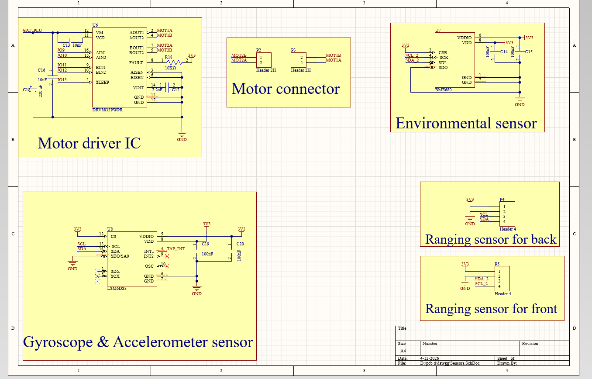
*Sheet 3: Sensor Section*

### PCB Layout
Designed at a precise 84mm x 83mm, keeping it under the cheap 100x100mm manufacturing threshold.
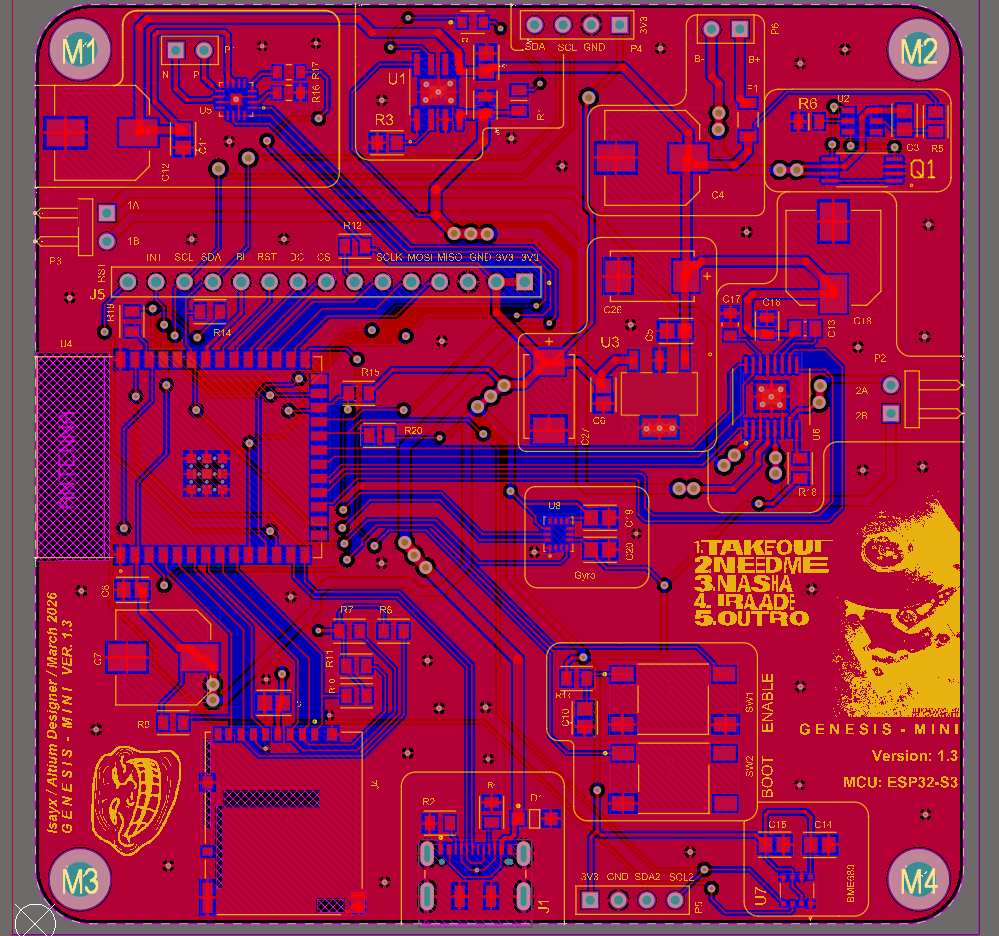

### PCB 3D View
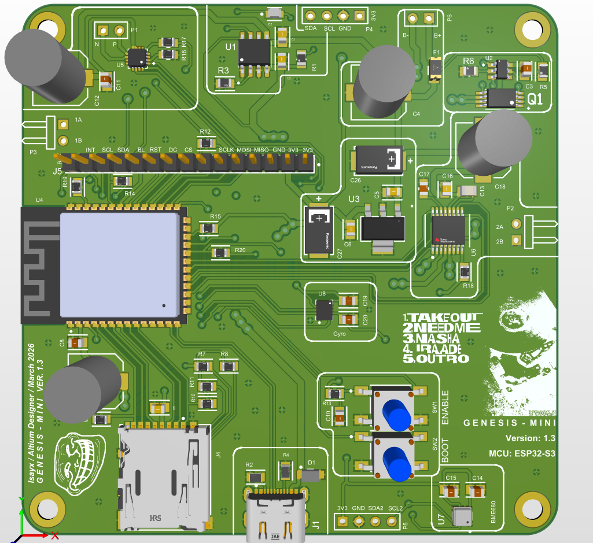

---

## 📦 Mechanical Design (Body)
The custom enclosure was modeled in **Onshape** and is split into 4 main 3D printable parts.
🔗 **[View 3D Model on Onshape](https://cad.onshape.com/documents/115dd9a062e470791892991f/w/46b9cbcaef62df69c897060a/e/b46bb490fd50a7f6dd43c250)**

### Head Cap
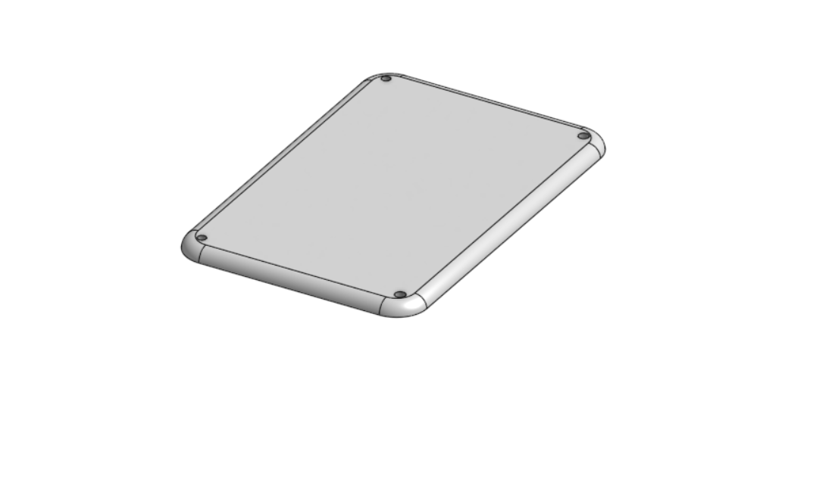

### Head
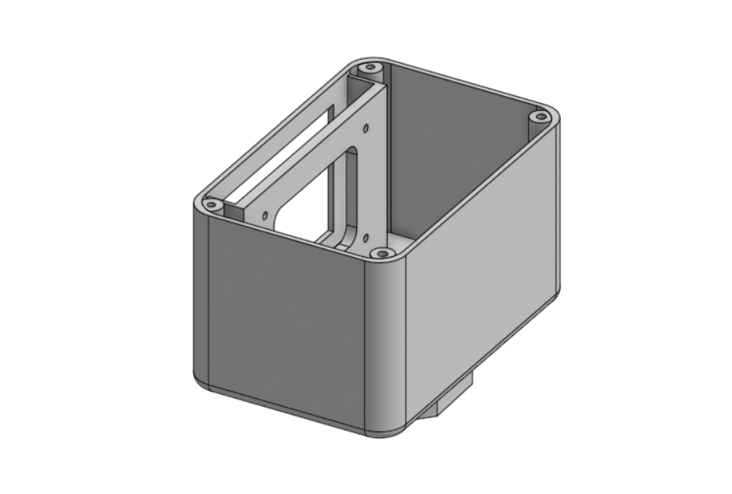
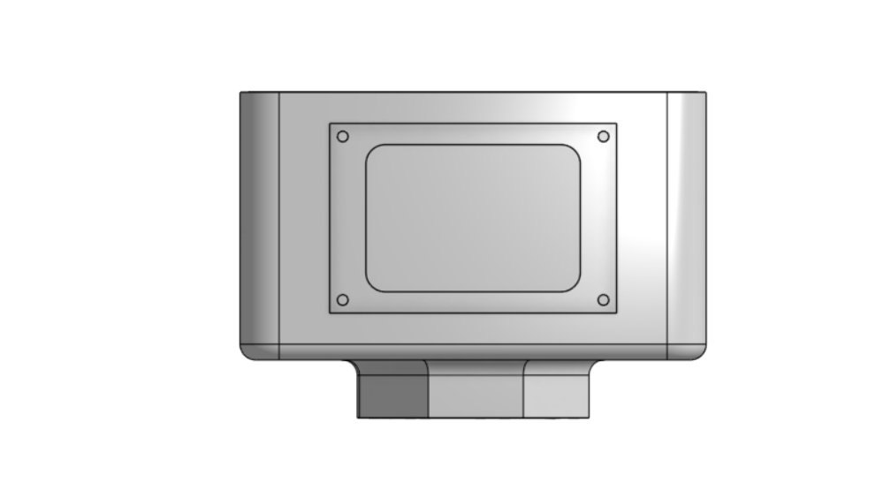

### Walls
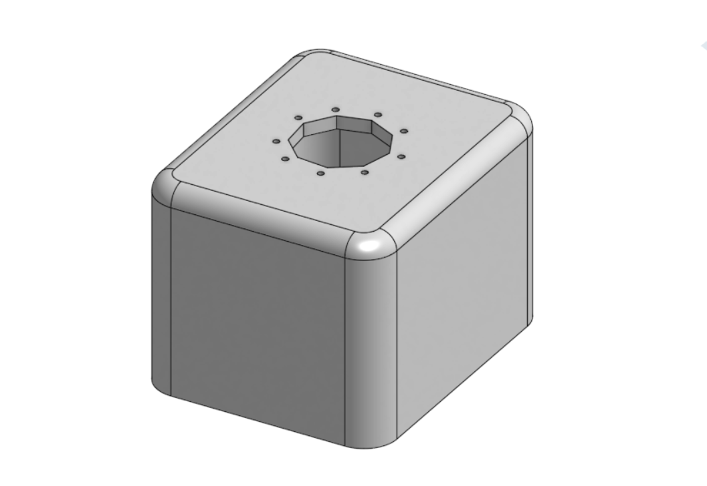
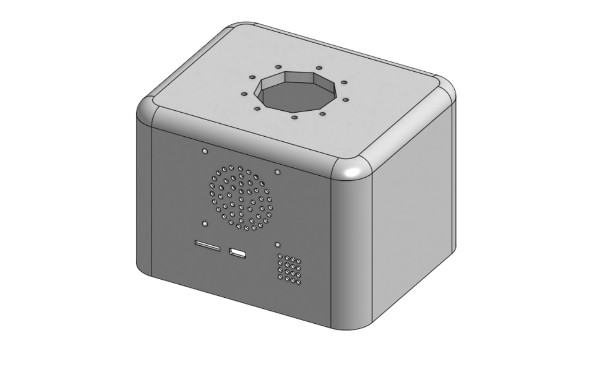

### Base
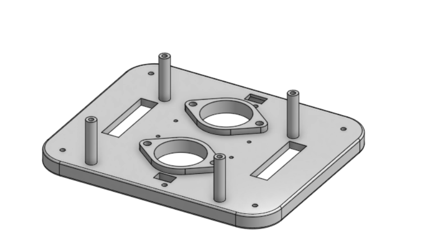
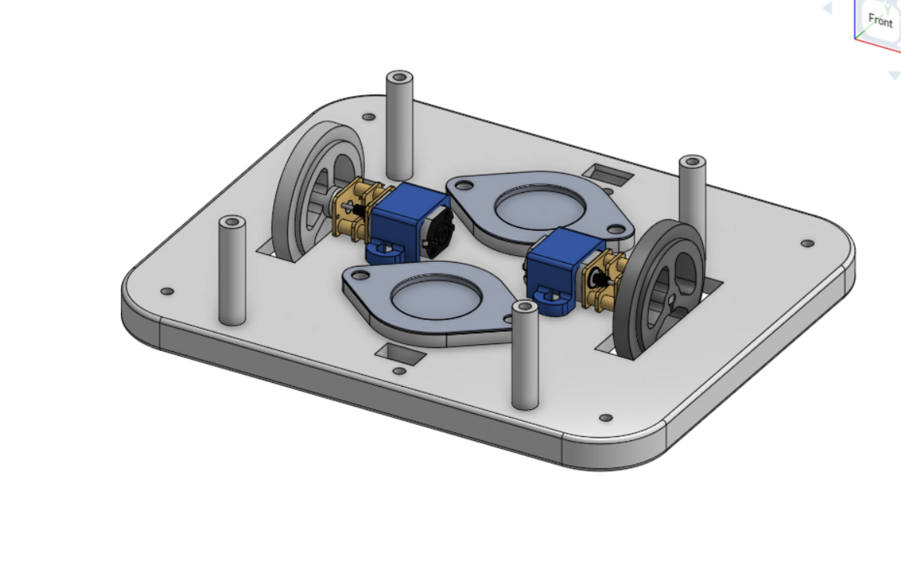

### Fully Assembled JZSBOT
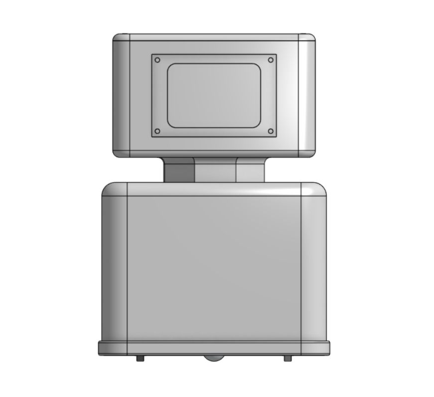
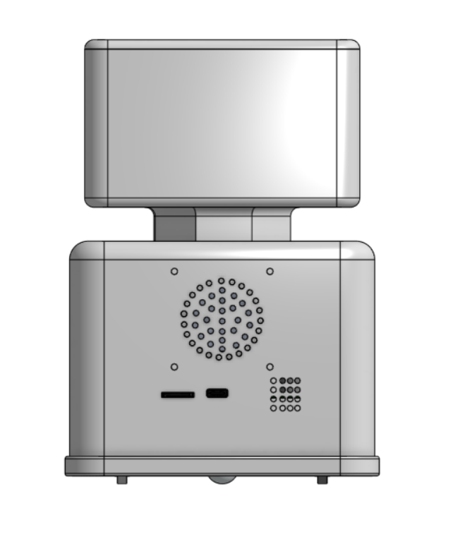
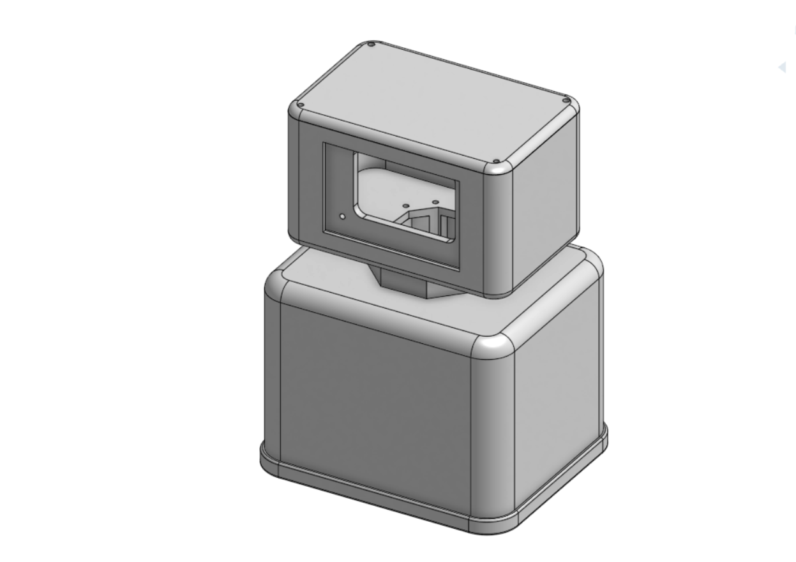

---

## ✨ Features
* **Brain:** ESP32-S3
* **Face:** 3.5" Waveshare Capacitive Touch Display
* **Audio:** On-board 4 ohm 3W speaker for personality sounds
* **Sensors:** BME680 (Environment), LSM6DS3 (Accelerometer & Gyroscopes) and VL53L0X (Distance)
* **Movement:** 2x N20 Motors with a middle drive layout and front/back ball casters for a floating and zero turn feel
* **Firmware:** C/C++

---

## 🛒 Bill of Materials (Hardware Needed)

* **1x** 3.5" Waveshare Capacitive Touch Display
* **1x** 4-ohm 3W Speaker
* **2x** N20 Micro Gear Motors 
* **2x** 34mm Wheels
* **2x** Ball Caster Wheels
* **2x** Li-ion Cylindrical Battery Cell
* **2x** VL53L0X Laser Ranging Sensor
* **1x** Custom PCBA
* Assorted M3 Screws, Nuts & Washers (for mounting display,speaker & connecting parts together)
* 3D Printed Parts (Base, Wall, Head, Head Cap)

---

### Extra stuff
**JZS SZN 2025 THEY KNOW IM COMING**

## 📄 License
This project is open-source and available under the **MIT License**.
